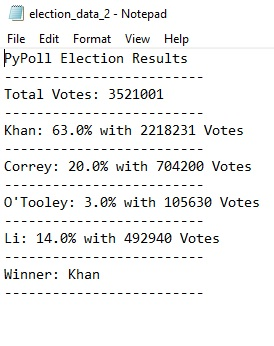

## PyElection

PyElection is a script that cleans poll data with Python and displays results. Polling data is place in the folder with the executable, and once clicked, the program will export a .txt file of the results. Multiple datasets can be ran with one click.
 
 